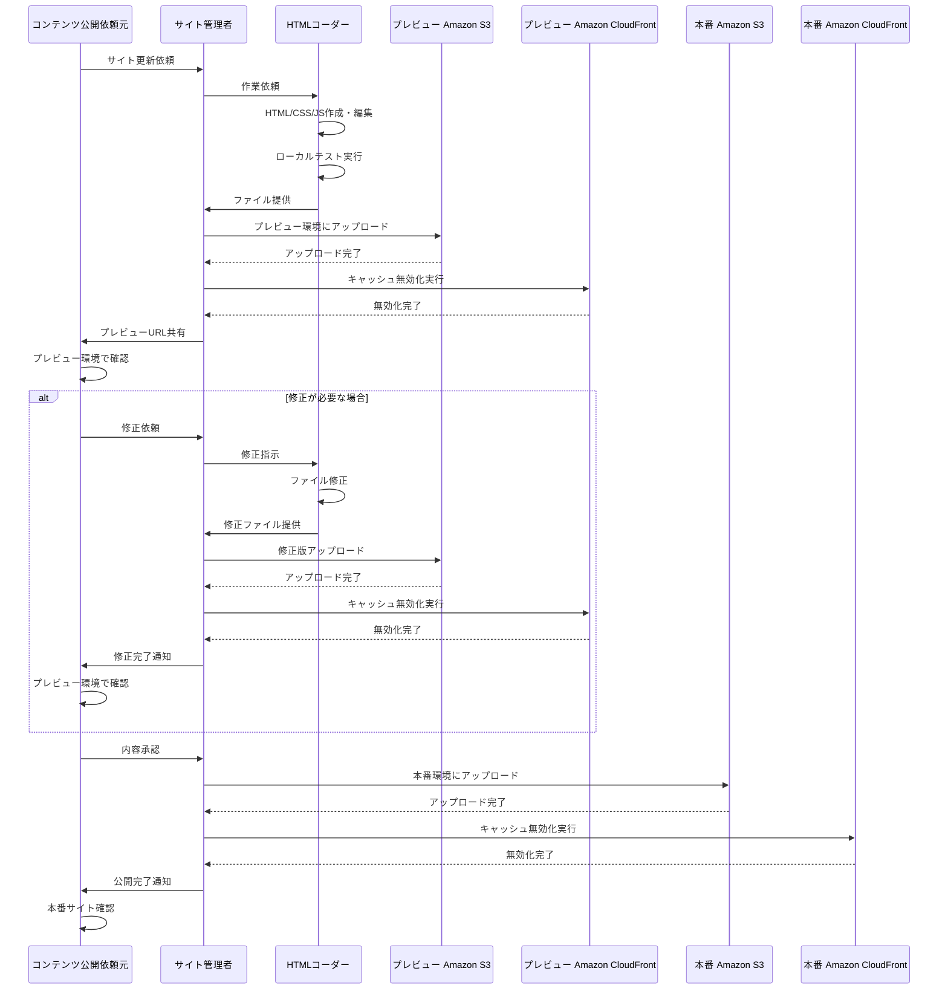
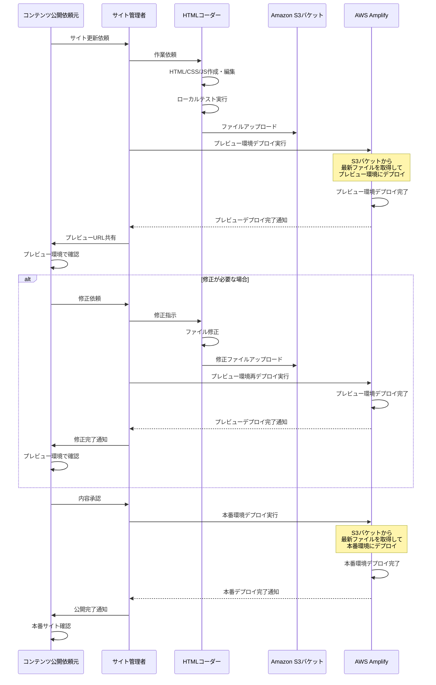
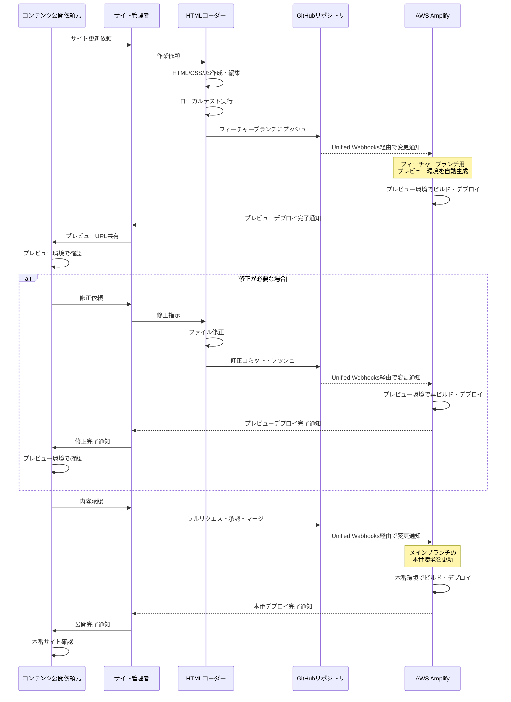

> この記事は下記の記事の日本語訳です。
> [Recheck the differences between AWS Amplify Hosting and Amazon S3 + Amazon CloudFront](https://dev.to/aws-builders/recheck-the-differences-between-aws-amplify-hosting-and-amazon-s3-amazon-cloudfront-2d2c)

## はじめに

AWS での静的サイトホスティングは、従来の Amazon S3 + Amazon CloudFront の組み合わせだけでなく、 AWS Amplify の Hosting 機能を使うこともできます。
AWS Amplify Hosting は、 GitHub との連携で自動的なデプロイのワークフローを提供しています。

また2024年10月以降、 Amazon S3 から直接 AWS Amplify Hosting 機能へ連携することもできるようになりました。

つまり、下記3つの選択肢があります:

- **Amazon S3 + Amazon CloudFront**
- **AWS Amplify Hosting (Amazon S3 との連携)**
- **AWS Amplify Hosting (GitHub との連携)**

本記事では、この3つのアプローチを比較し、 AWS Amplify を使う場合のメリットについて解説します。

## 各方式の特徴比較表

| 項目 | Amazon S3 + Amazon CloudFront | AWS Amplify + Amazon S3 | AWS Amplify + GitHub |
|------|-----------------|---------------|------------------|
| **ファイルアップロード** | Amazon S3 にアップロード | Amazon S3 にアップロード | Git Push |
| **デプロイトリガー** | なし(キャッシュ更新が実質的トリガー) | 手動 | 自動(Git Push による Unified Webhooks) |
| **キャッシュ更新** | 手動実行 | 自動実行 | 自動実行 |
| **プレビュー環境** | 別途インフラ構築が必要 | 手動で環境追加対応 | ブランチベースで自動生成 |
| **Basic認証** | Lambda@Edge で実装 | コンソールで設定 | コンソールで設定 |
| **監視・ログ** | 個別サービスで監視 | 統合ダッシュボード | 統合ダッシュボード |
| **ビルドプロセス (*)** | 手動実行後にアップロード | 手動実行後にアップロード | アップロード後に自動実行 |
| **ロールバック** | 手動でファイル復元 | 直前のデプロイ結果適用 | 直前のデプロイ結果適用 |

(*) ビルドプロセス: Next.js のようなライブラリ・フレームワークを利用し、静的サイトとしてファイル生成を行うプロセス。

### インフラ構築手順における違い

| 方法  | 主な作業 |
|------|----------|
| **Amazon S3 + Amazon CloudFront** | Amazon S3 Bucket 準備(Bucket 作成、Bucket ポリシー設定)、Amazon CloudFront 準備(Origin access control 設定、ディストリビューション作成) |
| **AWS Amplify + Amazon S3** | Amazon S3 Bucket 作成、AWS Amplify プロジェクト準備 |
| **AWS Amplify + GitHub** | AWS Amplify プロジェクト準備、GitHub Repository 準備 |

### デプロイ手順の比較

| 方法  | 主な作業 |
|------|----------|
| **Amazon S3 + Amazon CloudFront** | ファイル準備 → Amazon S3 アップロード → Amazon CloudFront キャッシュ無効化(明確なデプロイトリガーなし) |
| **AWS Amplify + Amazon S3** | ファイル準備 → Amazon S3 アップロード → AWS Amplify デプロイ |
| **AWS Amplify + GitHub** | Git プッシュのみ |

### 自動化レベル

| 方法 | 自動化レベル | 説明 |
|------|--------------|------|
| **Amazon S3 + Amazon CloudFront** | 手動 | 全ての作業を手動で実行 |
| **AWS Amplify + Amazon S3** | 半自動 | デプロイトリガーは手動、その後は自動 |
| **AWS Amplify + GitHub** | 完全自動 | Git プッシュから公開まで全自動 |

### 料金の違い(概算)

#### Amazon CloudFront データ転送料金(東京リージョン)

| データ転送量 | 料金（USD/GB） |
|-------------|---------------|
| 最初の 1TB | 無料 |
| 次の 9TB(1TB-10TB) | $0.114 |

#### AWS Amplify Hosting データ転送料金

| データ転送量 | 料金（USD/GB） |
|-------------|---------------|
| 最初の 15GB | 無料 |
| 15GB超 | $0.15 |

#### 料金比較シナリオ(東京リージョン)

| 月間データ転送量 | Amazon CloudFront(東京) | AWS Amplify Hosting | 差額 |
|-----------------|------------|-----------------|------|
| **15GB** | $0.00 | $0.00 | **$0** |
| **100GB** | $0.00 | $12.75 | **+$12.75** |
| **500GB** | $0.00 | $72.75 | **+$72.75** |
| **1TB** | $0.00 | $151.35 | **+$151.35** |
| **9TB** | $933.888 | $1380.15 | **+$446.262** |
| **10TB** | $1025.024 | $1,507.50 | **+$508.726** |

## 適用場面

### Amazon S3 + Amazon CloudFrontが適している場合

- 高度なカスタマイズや細かい制御が必要
  - 複雑なキャッシュ戦略や配信ルールが必要
  - 既存のCI/CDパイプラインとの統合が必要
- コスト最適化を重視(アクセスの多いサイト運用)

### AWS Amplify + Amazon S3が適している場合

- ファイルベースの直接的な管理を継続したい
  - ファイルアップロード担当者が Git を利用できないが Amazon S3 へのアクセスは可能など
- Amazon CloudFront のカスタマイズが不要
- AWS Amplify Hosting の機能(Basic認証、プレビュー環境準備の簡素化など)を利用したい
- サイトへのアクセスが限定的

### AWS Amplify + GitHubが適している場合

- チーム開発でのコラボレーションを重視
  - Git 連携による自動デプロイが必要
  - プレビュー環境やブランチデプロイが必要
- 迅速な開発とデプロイを重視
- 開発チームの AWS 運用経験が限定的
- モダンな開発ワークフローを採用したい
- サイトへのアクセスが限定的
- AWS Amplify Backend 機能を今後利用する可能性がある

## まとめ

AWS Amplify Hosting は、従来の Amazon S3 + Amazon CloudFront の組み合わせと比較して、セットアップの簡素化、自動化されたデプロイプロセス、統合された運用管理により、開発者の生産性を大幅に向上させます。一方、Amazon S3 + Amazon CloudFront は高度なカスタマイズが可能で、複雑な要件に対応できます。プロジェクトの要件と開発チームの状況に応じて、最適な選択肢を選ぶことが重要です。

## 参考: 運用フローの想定

### 関係者の役割定義

#### HTMLコーダー

- 静的サイトのHTML、CSS、JavaScriptファイルの作成・編集
- ローカル環境でのテスト・検証
- パターン(C): Gitリポジトリへのコード管理とプッシュ

### サイト管理者

- サイトの構築・運用
  - インフラ構築と監視
  - ビルド設定の管理
  - パターン(C): ブランチ管理とデプロイ承認（必要に応じて）
- 公開依頼元との連携
- HTMLコーダーへの作業依頼と進行管理

#### コンテンツ公開依頼元

- サイト更新の要求・承認
- コンテンツの提供と確認
- 公開スケジュールの決定

### (A) Amazon S3 + Amazon CloudFront シーケンス図

### (B) AWS Amplify + Amazon S3 シーケンス図

### (C) AWS Amplify + GitHub シーケンス図

